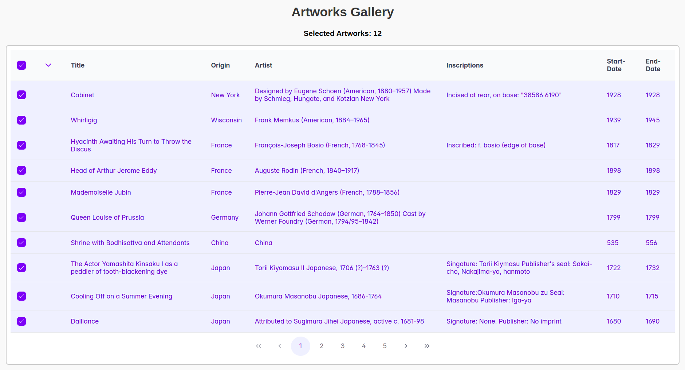
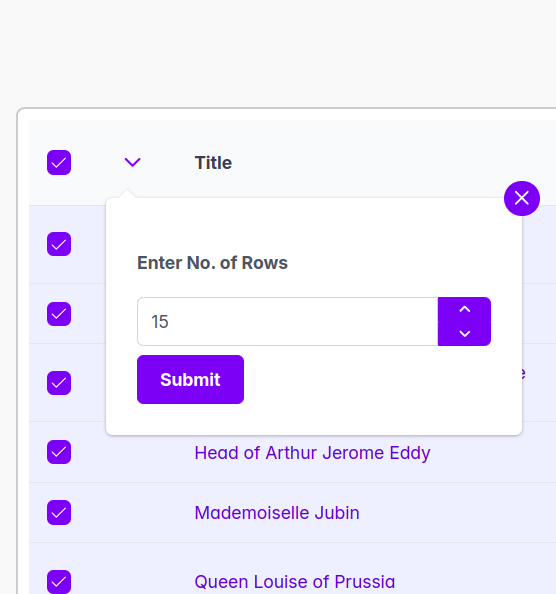

# GrowMeOrganic-Assignment

---

## 🖼️ React Artworks Explorer

A dynamic React + TypeScript web application built with **Vite** and **PrimeReact** to explore artworks using the [Art Institute of Chicago API](https://api.artic.edu/docs/#introduction). This app demonstrates **server-side pagination**, **row selection with persistence**, and a **custom overlay-based row selection panel**.

---

## 🚀 Features

- ✅ Built with **Vite** and **TypeScript**
- ✅ Uses **PrimeReact DataTable** for clean UI
- ✅ Server-side pagination with live API data
- ✅ **Checkbox-based row selection** across multiple pages
- ✅ **Persistent selection state** without storing all page data
- ✅ **Custom row selection overlay panel** using chevron-down button
- ✅ Responsive and styled with custom CSS (`ArtworkTable.css`)
- ✅ Deployed and production-ready

---

## 📸 Screenshots

| Main Table View | Overlay Panel |
|------------------|----------------|
|  |  |

---

## 📦 Tech Stack

- **Frontend**: React, TypeScript, Vite
- **UI Components**: PrimeReact (DataTable, OverlayPanel, InputNumber, Button)
- **HTTP**: Axios
- **Styling**: PrimeFlex, Custom CSS


---

### 🛠️ Getting Started

### 1. Clone the repo

```bash
git clone https://github.com/HeeraRana247453/GrowMeOrganic-Assignment.git
cd GrowMeOrganic-Assignment
```

### 2. Install dependencies

```bash
npm install
```

### 3. Run the project locally

```bash
npm run dev
```

Open [Localhost](http://localhost:5173) in your browser to view it.

---

## 🌐 Deployment

The app is deployed on **Netlify** and publicly accessible:

🔗 [Live Demo](https://gleeful-beijinho-4289a9.netlify.app/)

---

## 📁 Folder Structure

```
src/
├── components/
│   ├── ArtworkTable.tsx
│   └── ArtworkTable.css
├── App.tsx
├── main.tsx
└── index.css
```

---

## 📋 Assignment Requirements Covered

| Requirement | Status |
|-------------|--------|
| Vite + TypeScript setup | ✅ Done |
| PrimeReact DataTable | ✅ Used |
| Server-side pagination | ✅ Implemented |
| Row selection with checkboxes | ✅ Done |
| Selection persists across pages | ✅ Handled |
| Custom row selection panel | ✅ Included (OverlayPanel with chevron icon) |
| No memory overload (no full row cache) | ✅ Compliant |
| Deployed to Netlify | ✅ Done |

---

## 🙋‍♂️ Author

- **Name**: Heera Rana
- **GitHub**: [@HeeraRana247453](https://github.com/HeeraRana247453)